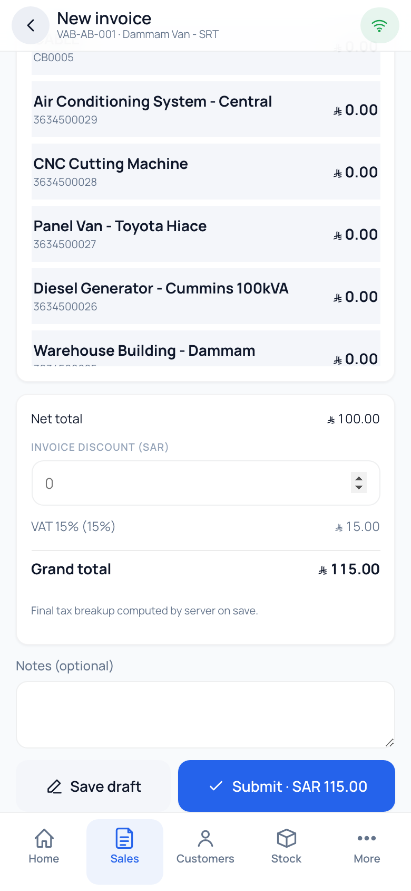

# Van Sale user guide

`index.html` is the guide — a single self-contained page, no build step, no assets
beyond the screenshots.

- **Read it:** open `index.html` in a browser.
- **Serve it to a client:** it is already deployed with the app at
  `https<!-- -->://<site>/assets/vansale/spa/../userguide/` only if you copy it there;
  the simplest route is to send the file or publish it.
- **Edit it:** plain HTML with an inline `<style>` block. Written against app
  v1.0.30 — the version is stated in the masthead, so bump it when the content
  changes.

## Screenshots

The guide ships with labelled wireframes for the key screens and **14 numbered
slots** where real screenshots belong. The full capture list is the last section
of the guide itself.

Save captures as `img/shot-01.png` … `img/shot-14.png`, then replace the matching
`<div class="shot">` placeholder with:

```html
<figure>
  
  <figcaption><b>Figure A4</b> — the invoice form.</figcaption>
</figure>
```

Take 01–10 on a real Android device, not an emulator: the print sheet and the GPS
permission prompt both render differently there, and those are the two screens
reviewers question.

## What it covers

| Part | Audience | Contents |
|---|---|---|
| A (A1–A10) | Drivers | First run, sign-in and PIN, home, selling, printing, collecting, returns, route/stock, offline and sync errors, More menu |
| B (B1–B13) | Office / admin | Workspace, Vansale Settings, Vansale Configuration field by field, assigned users, warehouse order, pricing chain, tax resolution and inclusive templates, per-van numbering, setting precedence, reports, admin tasks, troubleshooting, new-van checklist |
